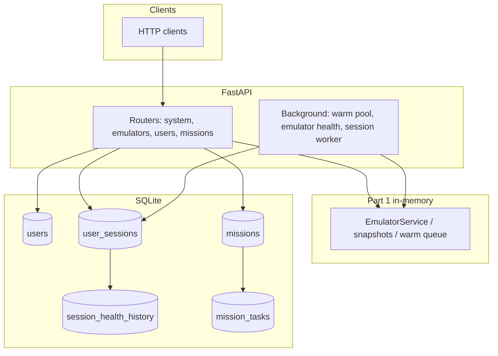

# Moboclaw documentation

**Moboclaw** FastAPI service: Android emulator orchestration (mock or SDK), SQLite-backed sessions and missions, and optional identity-gate webhooks.

## Table of contents

| Document | What it covers |
|----------|----------------|
| [Overview](#overview) | What the service does (this page) |
| [LOCAL.md](LOCAL.md) | Run on your machine (venv, Uvicorn, mock vs SDK, troubleshooting) |
| [API.md](API.md) | HTTP endpoints, bodies, responses |
| [ARCHITECTURE.md](ARCHITECTURE.md) | Components, background workers, mission flow |
| [DATA_MODEL.md](DATA_MODEL.md) | SQLite tables and relationships |
| [ASSUMPTIONS_AND_LIMITATIONS.md](ASSUMPTIONS_AND_LIMITATIONS.md) | Scope and known limits |

**Interactive API:** with the server running, open **`/docs`** (e.g. `http://localhost:8082/docs` when Compose maps `8082:8080`).

---

## Overview

### Three layers in one process

1. **Part 1 — Emulators**  
   REST API for provisioning emulators, layered snapshots (base → app → session), warm pool, and health checks.  
   - **Mock** backend: delays only, no real devices.  
   - **SDK** backend: real `emulator` + `adb`, full AVD directory clones under `EMULATOR_QCOW2_SESSION_ROOT`.

2. **Part 2 — Sessions**  
   SQLite: one **`user_sessions`** row per `(user_id, app_package)`, tiered health, mock “vision” checks, **verify** endpoint.

3. **Part 3 — Missions**  
   SQLite: missions and tasks; tasks grouped by `app_package` run in parallel; within one app, tasks run in order; each task provisions an emulator, simulates work, may hit an **identity gate**, then tears down.

### Where state lives

| Kind | Storage |
|------|---------|
| Running emulators, snapshot **catalog** (Part 1) | In-memory (`InMemoryStore`); **restart clears** the catalog unless you re-seed. |
| Users, sessions, missions, tasks | SQLite (`SESSION_DATABASE_URL`). |

### System diagram

Mission scheduling (parallel app chains, identity gate) is described in [ARCHITECTURE.md](ARCHITECTURE.md).
