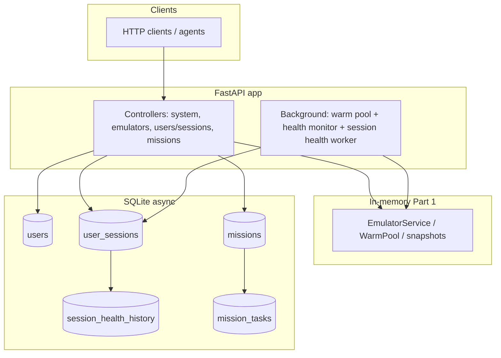

# Moboclaw documentation

This folder describes the **Mobile Agent Infrastructure** FastAPI service: mock Android emulator orchestration, SQLite-backed user sessions with tiered health checks, and mission execution with optional identity gates and webhooks.

## Contents

| Document | Description |
|----------|-------------|
| [Overview](#overview) | On this page: product summary and system diagram |
| [API.md](API.md) | HTTP endpoints, request/response shapes, status codes |
| [ASSUMPTIONS_AND_LIMITATIONS.md](ASSUMPTIONS_AND_LIMITATIONS.md) | Design assumptions and known limits |
| [ARCHITECTURE.md](ARCHITECTURE.md) | Components, data flow, background workers, scaling notes |
| [DATA_MODEL.md](DATA_MODEL.md) | Relational schema summary (sessions + missions) |

Interactive API: when the server is running, OpenAPI UI is at `/docs` (e.g. `http://localhost:8082/docs` with Docker Compose).

## Overview

Moboclaw is a single process exposing REST APIs for three layers:

1. **Emulators (Part 1)** — In-memory mock emulators with warm pool, snapshots (base → app → session), and background health probes. Swap `EmulatorService` for a real hypervisor or device farm without changing route contracts.
2. **Sessions (Part 2)** — Per-user, per-app session rows in SQLite with mock vision health (`alive` / `expired`), tiering from `last_access_at`, and a background worker for hot/warm scheduled checks.
3. **Missions (Part 3)** — Persisted missions and tasks; tasks grouped by `app_package` run in parallel chains; within each app, tasks run sequentially. Each task provisions a mock emulator, simulates work, may enter an **identity gate** (webhook + approve), then tears down the emulator.

### System diagram

For request-level flows inside a mission (parallel app chains, identity gate), see [ARCHITECTURE.md](ARCHITECTURE.md).
